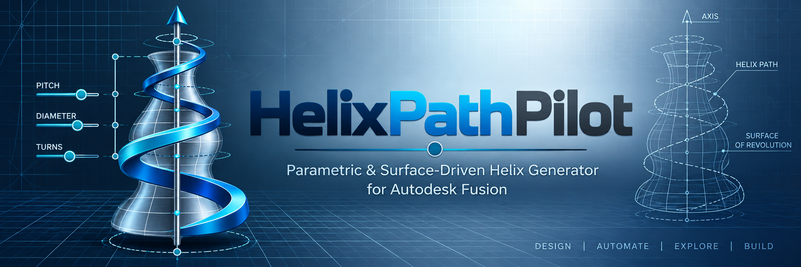
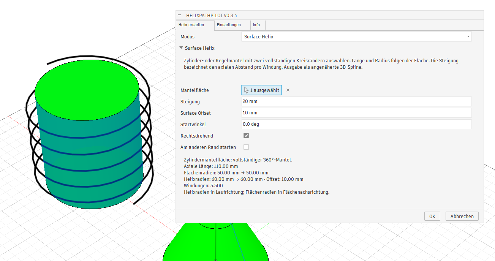

# HelixPathPilot
<p align="center">
  
</p>

**HelixPathPilot** ist ein Add-in für Autodesk Fusion zur Erzeugung parametrischer und oberflächengeführter Helix-Kurven.

Das Projekt soll deutlich mehr Flexibilität als eine klassische Helix mit konstanter Steigung und konstantem Durchmesser bieten. Geplant sind variable Steigungen, variable Durchmesser, mehrere Helix-Abschnitte, oberflächengeführte Helices auf rotationssymmetrischen Körpern, Live-Vorschau und wiederverwendbare Presets.

## Geplante Hauptfunktionen

- Parametrische Helix-Erzeugung
- Auswahl einer Helix-Achse
- Einstellbare Länge, Steigung und Durchmesser
- Rechts- und linksdrehende Helices
- Einstellbarer Startwinkel
- Mehrere Helix-Abschnitte
- Variable Durchmesser
- Variable Steigungen
- Lineare und später weiche Übergänge
- Live-Vorschau im Fusion-Viewport
- Erzeugung als 3D-Skizze
- Surface Helix auf rotationssymmetrischen Körpern
- Einstellbarer Surface Offset
- Speichern, Laden, Import und Export von Presets
- Spätere Erweiterung für Sweep-/Federkörper

## Arbeitsmodi

### Parametric Helix

Die Helix wird vollständig über Parameter wie Durchmesser, Steigung, Länge, Drehrichtung und Startwinkel definiert.

Mehrere Abschnitte können unterschiedliche Start- und Endwerte für Durchmesser und Steigung besitzen.

### Surface Helix

Ein rotationssymmetrischer Körper bzw. dessen Oberfläche dient als Formgeber. Die Helix folgt der Kontur des Körpers und kann optional mit einem Abstand zur Oberfläche erzeugt werden.

Dieser Modus eignet sich besonders für komplexe Federformen, konische Wicklungen oder andere Helices mit kontinuierlich veränderlichem Radius.

## Presets

Helix-Konfigurationen sollen unter frei wählbaren Namen gespeichert werden können.

Geplant ist ein JSON-basiertes Austauschformat:

```text
*.helixpilot.json
```

Damit können Vorlagen archiviert, mit Git versioniert und zwischen Installationen ausgetauscht werden.

## Mögliche Anwendungen

- Druckfedern
- konische und progressive Federn
- Drahtformen
- Heizspiralen
- Spiralschläuche
- Kabelwicklungen
- Schnecken und Förderschnecken
- dekorative Helices
- parametrische Sweep-Pfade
- Spezialgeometrien für den 3D-Druck

## Projektstatus

Der Entwicklungsstand **0.3.4** liegt unter `Fusion_addin/HelixPathPilot/`.
Parametrische und variable Helices besitzen eine abschaltbare Live-Vorschau.
Die Punktanzeige beschränkt sich auf Abschnittsgrenzen; Startdurchmesser folgen
über die gesamte Abschnittskette dem jeweiligen Vorgänger.
Neu sind die Dialogreiter „Einstellungen“ und „Info“ mit Logo und Projektlinks
sowie Surface Helix für vollständige Zylinder- und Kegelmäntel mit konstanter
Steigung, schneller Vorschau und 3D-Skizzenausgabe.
**Volumenkörper → Erstellen → HelixPathPilot v0.3.4** erzeugt eine 3D-Skizze um eine gewählte Achse.
Bis zu 32 Abschnitte mit eigener Länge, Start-/Enddurchmesser und Start-/Endsteigung
lassen sich hinzufügen und entfernen. Drehrichtung und Startwinkel gelten gemeinsam.
„Achslänge übernehmen“ passt die Gesamtlänge einmalig an eine endliche Linie oder gerade Kante an.
Die neue Option „Tangentiale Übergänge (G1)“ gleicht Abschnittstangenten für den Sweep an;
der Benutzer bestätigt einen verbesserten Übergang im Sweep-Beispiel.
Konstruktionsachsen, gerade Kanten und Skizzenlinien werden unterstützt;
ohne Auswahl gilt die globale Z-Achse. Basis-Command, Achsauswahl und Icons wurden
vom Benutzer bestätigt. Abschnittsverwaltung und variable Ausgabe sind implementiert
und automatisiert geprüft; der Benutzer bestätigt die grundsätzliche Funktion von 0.2.2.
Der Ordner `HelixPathPilot/` im Repo-Hauptverzeichnis ist der inaktive Altstand 0.1.0.

Die [Entwicklungsanleitung](docs/development.md) beschreibt das Laden und die manuelle Prüfung in Fusion.

Die genaue Funktionalität und Benutzeroberfläche kann sich während der Entwicklung verändern.

## Screenshots

Surface Offset mit **v0.3.4**: Vorschau auf einem Zylinder mit 10 mm Abstand zur Mantelfläche.

[](docs/screenshots-DE.md#v034)

Die [Screenshot-Galerie nach Versionen](docs/screenshots-DE.md) zeigt zusätzlich
Kegel- und Wickelbeispiele sowie frühere Versionen mit Abschnittsdialog, Erstellen-Menü und Symbolleiste. Die Bilder
dokumentieren die angegebene Version; neuere Versionen können davon abweichen.

## Weiterführende Projektdokumente

Zusätzliche Projektdokumente befinden sich im Ordner `docs/`:

- [CodeX Plan](docs/codex_plan.md) – Umsetzungsregeln und Arbeitsweise für die Weiterentwicklung
- [Ablaufplan](docs/ablaufplan.md) – geplanter Umsetzungsweg mit Versionslogik
- [Timeline](docs/timeline.md) – nachvollziehbare Entwicklungshistorie und Änderungsdokumentation

Die README konzentriert sich bewusst auf die Projektübersicht. Detaillierte Entwicklungs- und Fortschrittsinformationen werden in den oben verlinkten Dokumenten gepflegt.

## Autor

**Know-How-Schmiede**

- Website: https://www.know-how-schmiede.de
- YouTube: https://www.youtube.com/@knowhowschmiede
- GitHub: https://github.com/know-how-schmiede

## Hinweis

HelixPathPilot ist ein unabhängiges Projekt und steht in keiner offiziellen Verbindung zu Autodesk.

Autodesk und Fusion sind Marken bzw. eingetragene Marken ihrer jeweiligen Rechteinhaber.
