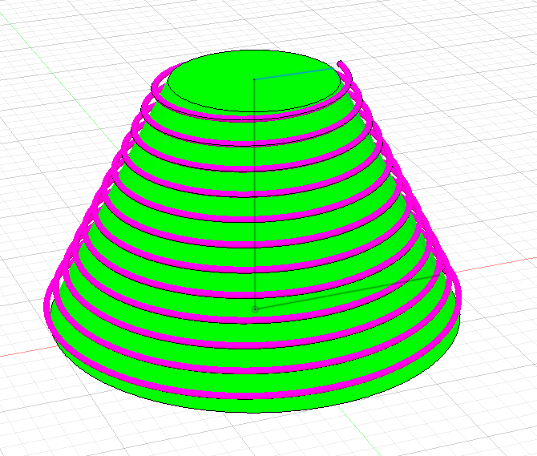

# HelixPathPilot
<p align="center">
  
</p>

**HelixPathPilot** is an Autodesk Fusion add-in for creating parametric and surface-driven helix curves.

The project is intended to provide significantly more flexibility than a conventional helix with constant pitch and diameter. Planned capabilities include variable pitch, variable diameter, multiple helix sections, surface-driven helices on rotational bodies, live preview and reusable presets.

## Planned Main Features

- Parametric helix generation
- Selectable helix axis
- Configurable length, pitch and diameter
- Right-handed and left-handed helices
- Configurable start angle
- Multiple helix sections
- Variable diameters
- Variable pitch
- Linear and later smooth transitions
- Live preview in the Fusion viewport
- Generation as a 3D sketch
- Surface Helix on rotational bodies
- Configurable surface offset
- Save, load, import and export presets
- Optional wire sweep with diameter input and self-intersection preflight

## Working Modes

### Parametric Helix

The helix is fully defined by parameters such as diameter, pitch, length, handedness and start angle.

Multiple sections may use different start and end values for diameter and pitch.

### Surface Helix

A rotational body or its surface is used as the geometric driver. The helix follows the body contour and can optionally be created with a configurable offset from the surface.

This mode is especially useful for complex spring shapes, tapered windings and other helices with continuously varying radius.

## Presets

Helix configurations can be saved under user-defined names.

A JSON-based exchange format is planned:

```text
*.helixpilot.json
```

This allows presets to be archived, versioned with Git and transferred between installations.

## Possible Use Cases

- Compression springs
- Conical and progressive springs
- Wire forms
- Heating coils
- Spiral hoses
- Cable windings
- Augers and screw conveyor paths
- Decorative helices
- Parametric sweep paths
- Special geometries for additive manufacturing

## Project Status

Development version **0.6.3** lives in `Fusion_addin/HelixPathPilot/`.

**Windows installer:** [EXE with English/German language selection](installer/dist/HelixPathPilot-0.6.3-Windows-Setup.exe).
[Installation, build instructions and Fusion paths](installer/README.md).

0.6.3 reduces unnecessary wire-clearance comparisons by choosing the least
crowded sweep coordinate. Collision thresholds remain unchanged.

0.6.2 adds repeated-interaction stability tests and fixes a logging regression
found in the working tree. All 160 automated tests pass.

0.6.1 adds timestamps and version labels to log entries and prevents logging
failures from interrupting error handling.

0.6.0 improves cleanup after sketch or wire output failures: deletion errors
no longer obscure the original cause.

0.5.1 identifies the field and section for invalid expressions and displays
Surface input errors in the visible Surface panel.

0.5.0 improves preview updates: unchanged path values retain the existing
graphics, while changed or invalid inputs remove stale previews.

**Wire body (0.4.5):** Enable “Drahtkörper erstellen” on the creation tab and enter
the wire diameter (default 1 mm). On OK, the solved spline undergoes a numerical
curvature and self-intersection preflight before a circular profile is swept as
a new body. Both modes are supported; the preview continues to show the colored
path. Wire settings are not stored in presets. See [development notes](docs/development.md)
for validation limits and Fusion checks still required.
The [preset foundation](docs/presets.md) includes a validated JSON data model
and three examples available in the dedicated “Vorlagen” (Presets) tab. Select a preset and click “Vorlage laden” to load it. Named user presets can also be saved, loaded and deleted there, with JSON file import and export.
Parametric and variable helices have an optional live preview with distinct section colors. The compact dialog uses a scrollable content area. Point display
is reduced to section boundaries, and start diameters follow the preceding
section throughout the full chain.
New Settings and Info tabs provide the G1 option, project logo and links.
Surface Helix creates a 3D sketch on full cylindrical and conical faces with
constant or linearly varying axial pitch, a fast preview and a choice of starting rim.
**Solid → Create → HelixPathPilot v0.6.3** creates a 3D sketch around a selected axis.
Add or remove up to 32 sections with individual lengths, start/end diameters
and start/end pitches. Handedness and start angle apply to the whole helix.
“Achslänge übernehmen” fits the total length to a finite straight line or edge once.
The new “Tangentiale Übergänge (G1)” option aligns section tangents for sweeping;
the user reports an improved transition in the sweep example.
Construction axes, straight edges and sketch lines are supported, with global Z
as the default. The user confirmed the basic command, axis selection and icons work.
The segment editor and variable helix output are implemented and covered by
automated tests; the user has confirmed the basic functionality of 0.2.2 in Fusion.
The top-level `HelixPathPilot/` folder is the inactive 0.1.0 scaffold.

See [development setup and smoke checks](docs/development.md) for loading the add-in in Fusion.

Features and user interface details may change during development.

## Screenshots

Wire bodies in **v0.4.5**: Surface Helix on a cone. The user has confirmed the feature works in Fusion.

[](docs/screenshots.md#v045)

See the [versioned screenshot gallery](docs/screenshots.md) for cone and winding examples
and earlier versions, including the section editor, Create menu and toolbar. Screenshots document the version shown; newer versions
may look different.

## Additional Project Documents

Additional project documentation is available in the `docs/` folder:

- [CodeX Plan](docs/codex_plan.md) – implementation rules and development workflow
- [Implementation Plan](docs/ablaufplan.md) – planned implementation path with version milestones
- [Timeline](docs/timeline.md) – traceable project history and change log

The README is intentionally focused on the project overview. Detailed planning and development progress are maintained in the linked documents above.

## Author

**Know-How-Schmiede**

- Website: https://www.know-how-schmiede.de
- YouTube: https://www.youtube.com/@knowhowschmiede
- GitHub: https://github.com/know-how-schmiede

## Disclaimer

HelixPathPilot is an independent project and is not officially affiliated with Autodesk.

Autodesk and Fusion are trademarks or registered trademarks of their respective owners.
