# HelixPathPilot – Screenshots

[Projektübersicht](../README-DE.md) · [English](screenshots.md)

Die Screenshots sind nach der dargestellten Version gegliedert, neueste zuerst.
Jede Version dokumentiert ihre damalige Oberfläche und Funktionen. Die Bilder
müssen daher nicht dem aktuellen Entwicklungsstand entsprechen.

## Versionen

- [v0.4.1](#v041) – Vorlagenauswahl und geladene variable Helix
- [v0.3.5](#v035) – variable Surface-Steigung auf Zylinder und Kegel
- [v0.3.4](#v034) – Surface Offset und Vorschau mit positivem und negativem Abstand
- [v0.3.3](#v033) – Surface Helix auf Zylinder und Kegel, Vorschau und Anwendungsbeispiele
- [v0.2.3](#v023) – tangentiale Übergänge, drei Abschnitte und Zebraanalyse
- [v0.2.2](#v022) – Anwendungsbeispiel und Abschnittsdialog
- [v0.1.2](#v012) – Achsausrichtung, Parameterdialog, Menü und Symbolleiste

## v0.4.1

### Mitgelieferte Vorlagen auswählen

Die aufgeklappte Liste zeigt die drei Vorlagen: „Basishelix 20 × 50 mm“,
„Surface 5 → 10 mm“ und „Zwei variable Abschnitte“. Erst **Vorlage laden**
übernimmt die ausgewählten Parameter; die Auswahl allein ändert keine Werte.

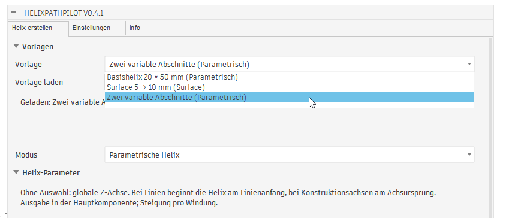

### Geladene Vorlage mit bearbeiteten Abschnitten

Der Hinweis „Geladen: Zwei variable Abschnitte“ bestätigt die Übernahme.
Das Bild zeigt die Vorschau mit anschließend angepassten Werten: zwei Abschnitte
mit jeweils 50 mm Länge, Durchmessern 10 → 30 → 10 mm und Steigungen
5 → 10 → 5 mm. Diese Werte unterscheiden sich von der mitgelieferten Vorlage.
Die Abschnittsnummern 3 und 4 bleiben während des Dialogs fortlaufend vergeben.

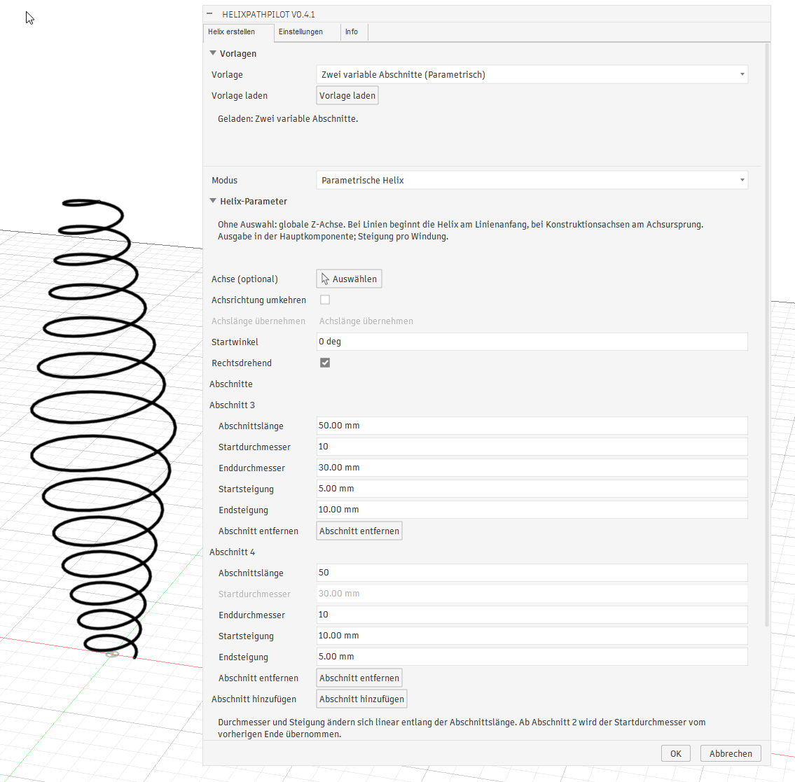

Der Benutzer bestätigt die sichtbare Vorlagenauswahl und das Laden in Fusion.

## v0.3.5

### Zunehmende Steigung am Zylinder

Die Vorschau zeigt eine Startsteigung von 5 mm und eine Endsteigung von 30 mm
bei 110 mm axialer Länge. Mit +5 mm Offset beträgt der Helixradius 55 mm;
der Dialog zeigt 7,884 Windungen. Die Windungsabstände nehmen entlang der Laufrichtung zu.

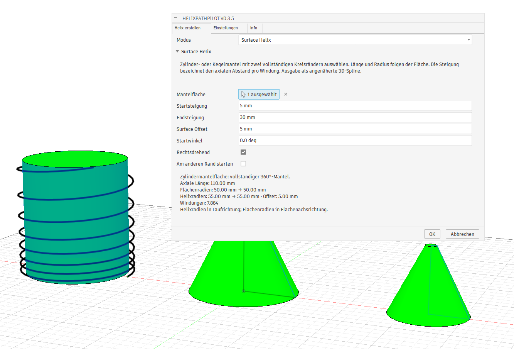

### Abnehmende Steigung am Kegel

Die Steigung nimmt von 20 mm auf 2 mm ab. Bei 60 mm axialer Länge und +5 mm
Normalabstand zeigt der Dialog 7,675 Windungen sowie Helixradien von
54,472 → 24,472 mm. Zum schmalen Ende hin liegen die Windungen dichter zusammen.

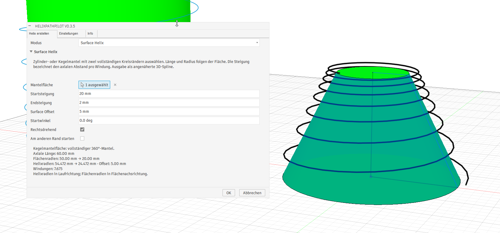

Der Benutzer bestätigt die Funktion der variablen Surface-Steigung in Fusion.

## v0.3.4

### Positiver Offset am Zylinder

Die Vorschau zeigt die Helix mit 10 mm Abstand zur Zylindermantelfläche.
Aus 50 mm Flächenradius werden 60 mm Helixradius. Bei 110 mm axialer Länge
und 20 mm Steigung entstehen 5,5 Windungen.

### Negativer Offset am Kegel

Mit −5 mm Normalabstand liegt die Helix innerhalb des transparent dargestellten
Kegelmantels. Die Flächenradien betragen 35 → 5 mm, die angezeigten Helixradien
30,528 → 0,528 mm. Bei 60 mm Länge und 10 mm Steigung entstehen sechs Windungen.

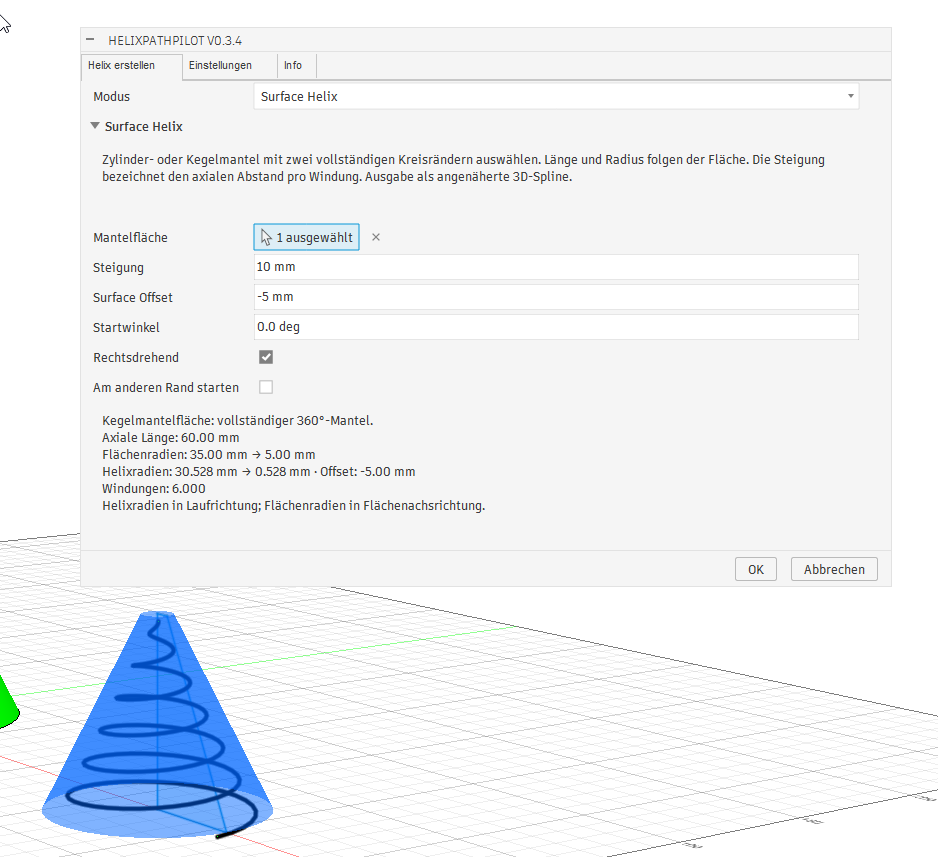

### Positiver Offset am Kegel

Der Normalabstand von +5 mm verschiebt die Helix nach außen. Der Dialog zeigt
Flächenradien von 50 → 20 mm und Helixradien von 54,472 → 24,472 mm.
Die radiale Differenz ist beim Kegel kleiner als der senkrechte Abstand.

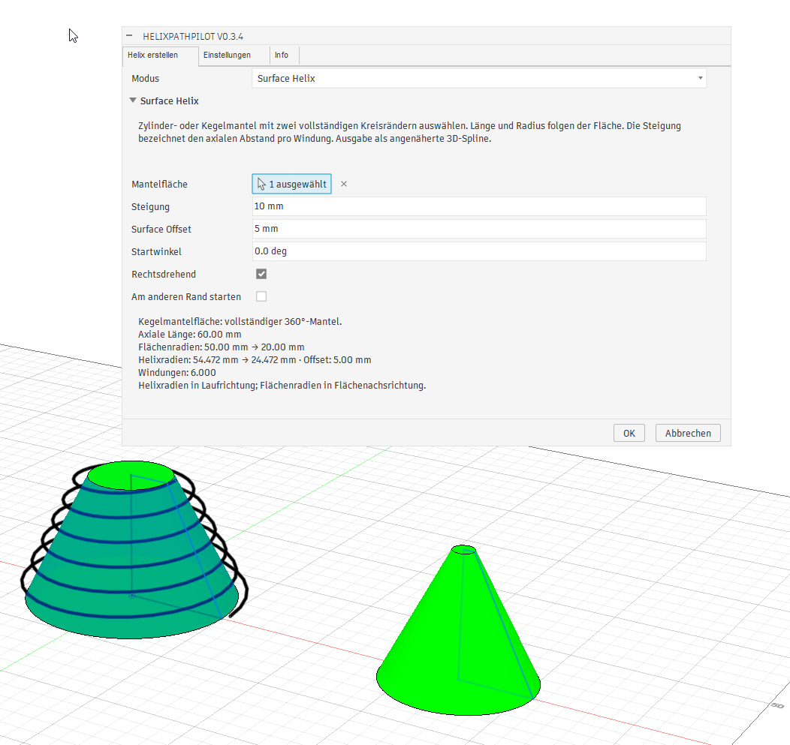

Der Benutzer bestätigt die Offset-Funktion, die Vorschau und ausdrücklich
auch den negativen Abstand zur Mantelfläche.

## v0.3.3

### Surface Helix auf einem Zylinder

Ausgewählte Zylindermantelfläche mit Helix-Vorschau und Dialog: 110 mm axiale
Länge, 50 mm Radius, 10 mm Steigung und 11 Windungen. Der Startwinkel beträgt −45°.

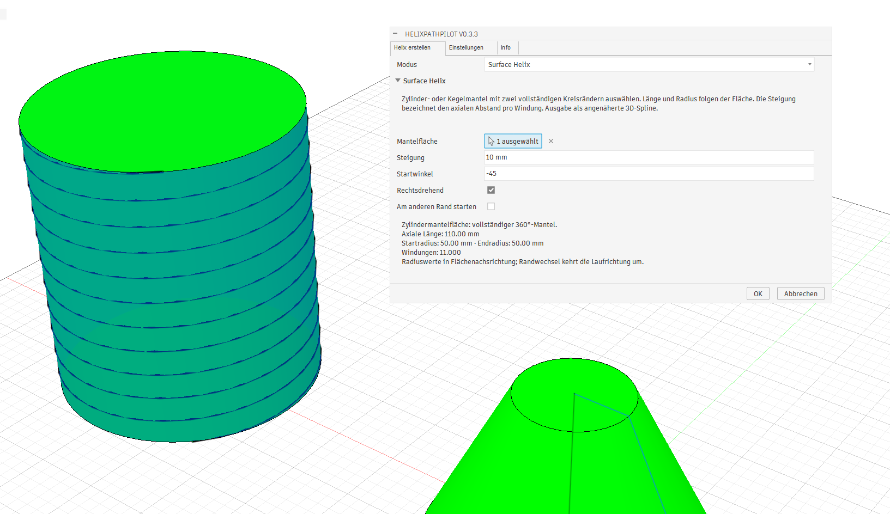

### Surface Helix auf einem Kegelstumpf

Der Dialog zeigt 60 mm axiale Länge, einen Radiusverlauf von 50 auf 20 mm und
sechs Windungen bei 10 mm Steigung. Die ausgewählte Mantelfläche und der
vorgezeichnete Helix-Pfad sind im Modell sichtbar.

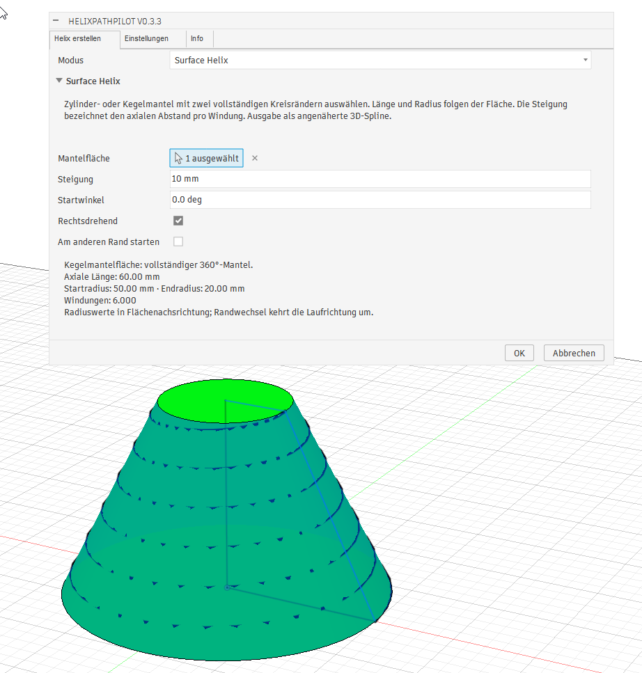

### Anwendungsbeispiele mit den erzeugten Pfaden

Die Bilder zeigen eine spiralförmige Nut am Kegelstumpf, einen magentafarbenen
Wickelkörper am Kegel und eine Wicklung mit rundem Querschnitt am Zylinder.
HelixPathPilot erzeugt die Skizzenpfade; die gezeigten Körper und Nuten entstehen
in anschließenden Modellierungsschritten in Fusion.

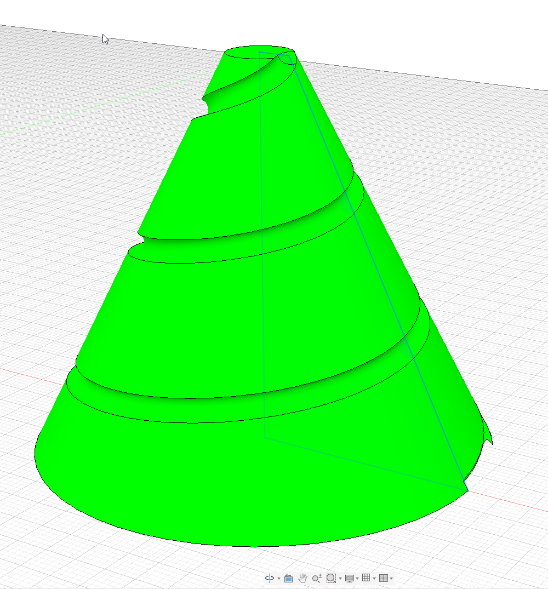

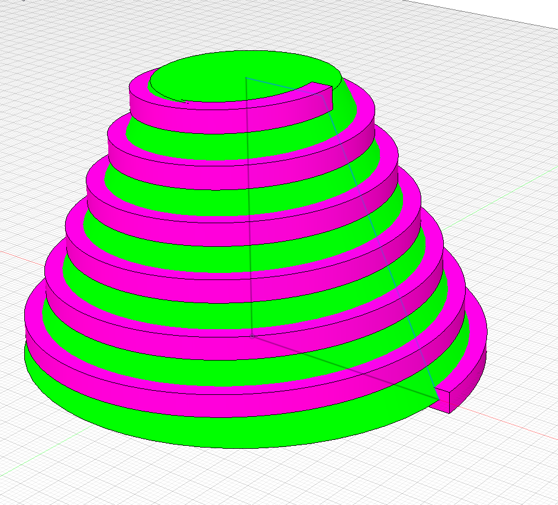

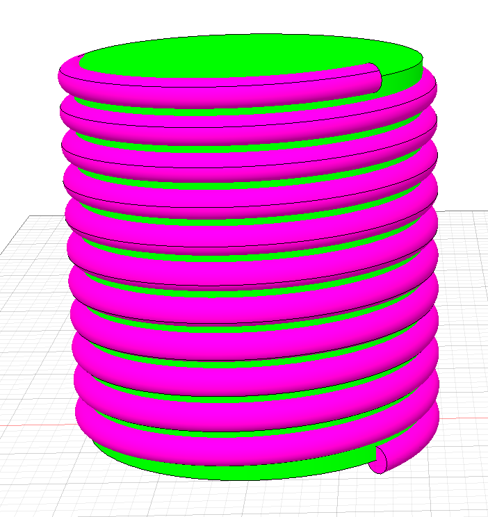

Die grundsätzliche Funktion der Surface-Helix-Erzeugung wurde vom Benutzer bestätigt.

## v0.2.3

### Sweep-Körper und Helix-Pfad

Eine Helix mit drei Abschnitten und verändertem Durchmesser- und Steigungsverlauf:
als Skizzenpfad und als anschließend in Fusion modellierter Sweep-Körper.
Die Körpererzeugung erfolgt in einem eigenen Modellierungsschritt.

| Sweep-Körper | Helix-Pfad mit Stützpunkten |
| --- | --- |
| 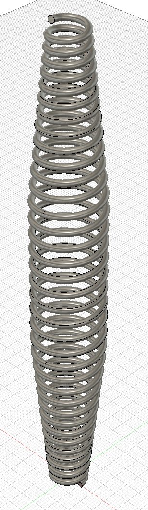 | 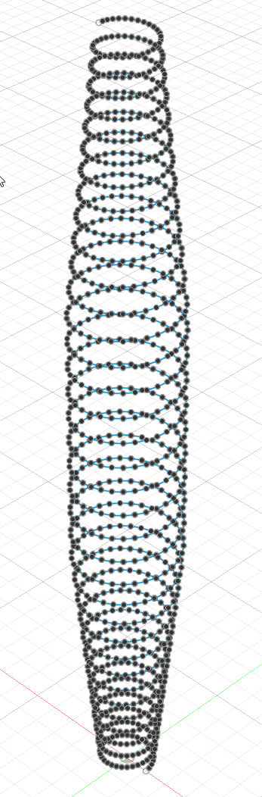 |

### Abschnittsdialog mit aktivierten G1-Übergängen

**Tangentiale Übergänge (G1)** ist aktiviert. Das Beispiel verwendet drei
Abschnitte mit jeweils 50 mm Länge, insgesamt 150 mm axialer Länge und einer
angezeigten Windungszahl von 35,541.

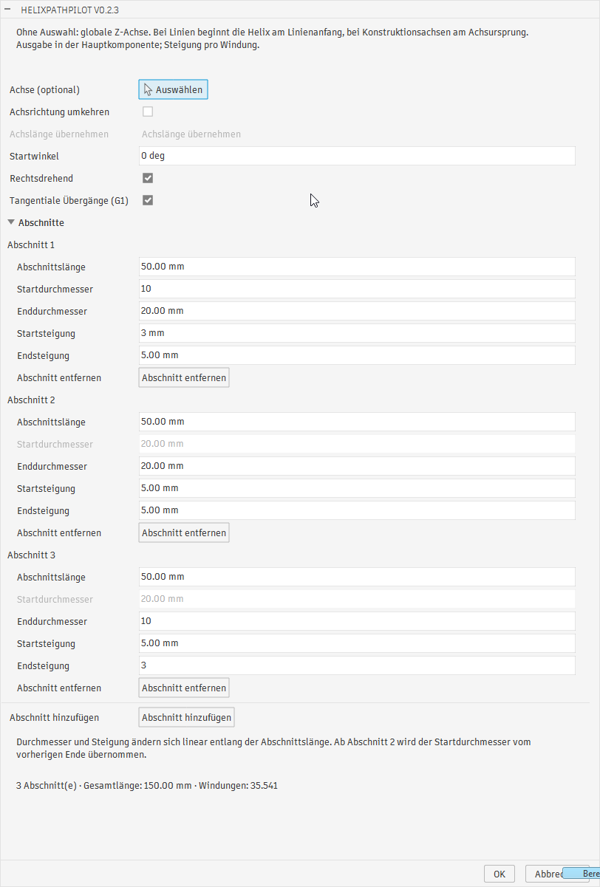

### Übergangsdetail mit Zebraanalyse

Der rote Pfeil markiert einen Abschnittsübergang am Sweep-Körper. Der Benutzer
bestätigt eine verbesserte Darstellung nach der G1-Angleichung. Die Zebraansicht
dokumentiert das Erscheinungsbild dieses Beispiels; sie belegt keine
G2-Krümmungsstetigkeit.

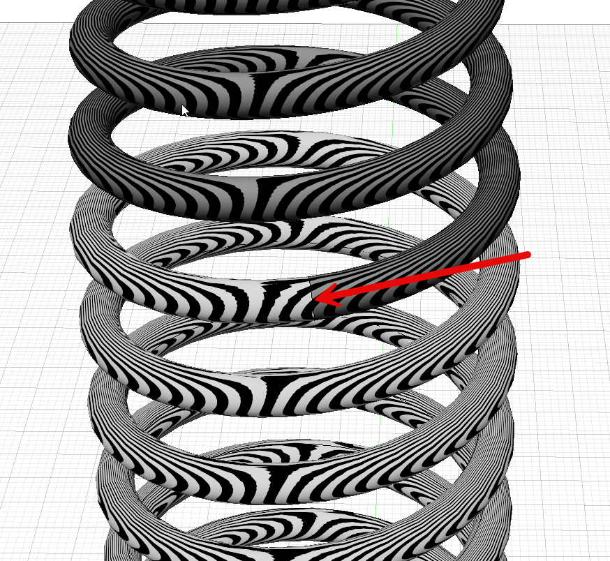

## v0.2.2

### Anwendungsbeispiel

Ein federförmiger Körper mit unterschiedlichen Windungsabständen entlang einer
schrägen Achse, daneben Helix-Skizzengeometrie. HelixPathPilot erzeugt die
Skizzenpfade; die Körpererzeugung erfolgt als eigener Modellierungsschritt in Fusion.

### Abschnittsdialog

Der vollständige Dialog mit **Abschnitt 1**, Start-/Enddurchmesser und -steigung,
Abschnittsverwaltung, Gesamtlänge und Windungszahl. **Achslänge übernehmen** ist
hier deaktiviert, da keine endliche Linie oder Kante ausgewählt ist.

## v0.1.2

### Helices entlang einer schrägen Achse

Helix-Kurven mit ihren Spline-Stützpunkten um eine schräge Linie im Fusion-Viewport.

### Parameterdialog

Optionale Achsauswahl, Achsrichtungsumkehr, Durchmesser, axiale Länge, Steigung,
Startwinkel und Drehrichtung. Ohne Achsauswahl wird die globale Z-Achse verwendet.

### Erstellen-Menü

Der versionierte Eintrag **HelixPathPilot v0.1.2** mit Helix-Icon unter
**Volumenkörper → Erstellen**.

### Icon in der Symbolleiste

Das Helix-Icon ermöglicht den direkten Aufruf im Bereich Erstellen.

## Weitere Versionen ergänzen

Originalbilder unter `docs/images/screenshots/v<major>-<minor>-<patch>/` ablegen.
In diesem Dokument und [der englischen Galerie](screenshots.md) jeweils einen
Versionsabschnitt mit Inhaltsverzeichnis-Link, kurzen Bildunterschriften und
aussagekräftigen Alternativtexten ergänzen. Ältere Abschnitte und Bilder bleiben
erhalten. Die READMEs enthalten jeweils nur ein ausgewähltes Vorschaubild und
den Galerie-Link; bei Bedarf Vorschau und Versionsbeschriftung gemeinsam aktualisieren.
