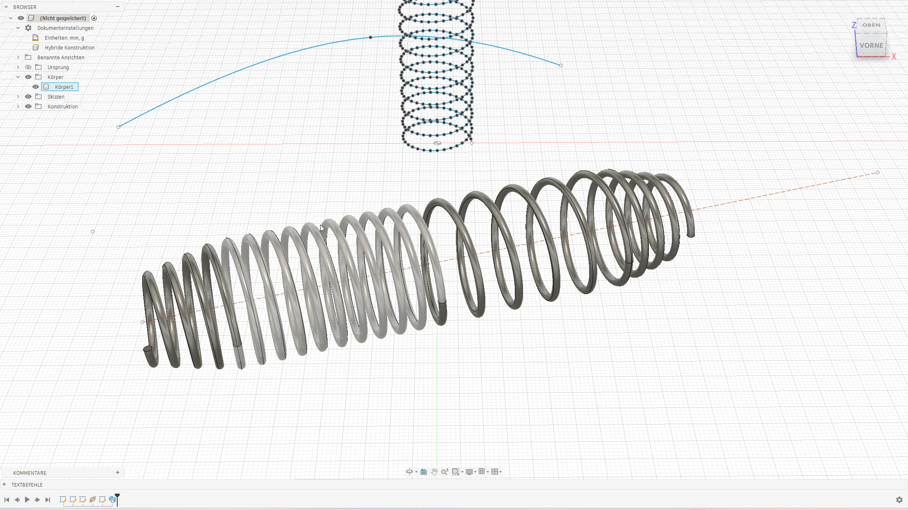
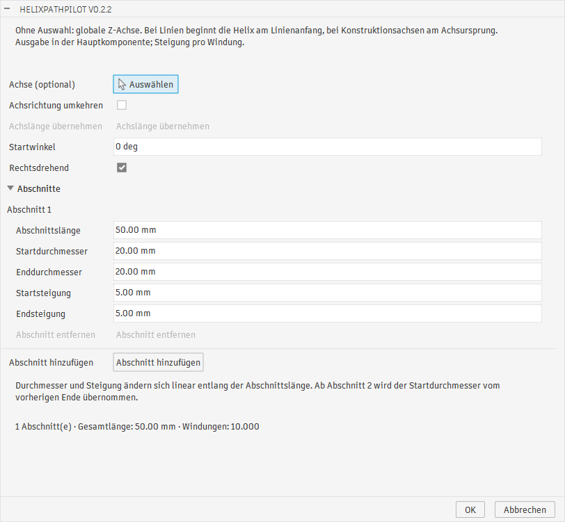
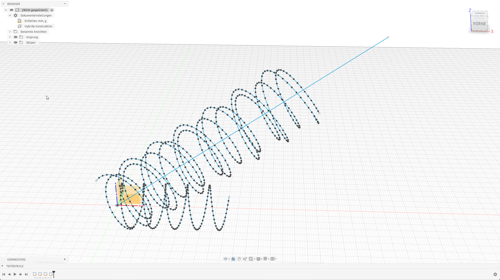
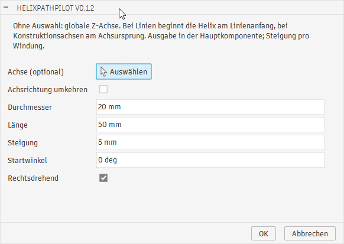
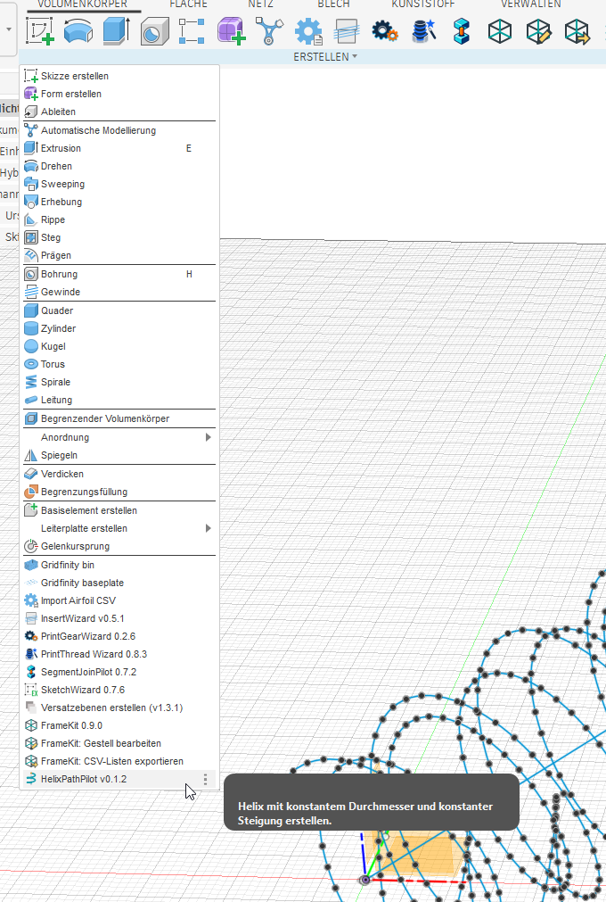
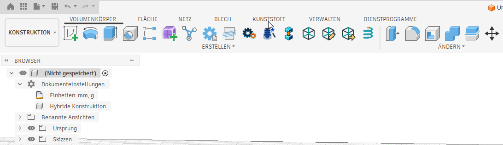

# HelixPathPilot – Screenshots

[Projektübersicht](../README-DE.md) · [English](screenshots.md)

Die Screenshots sind nach der dargestellten Version gegliedert, neueste zuerst.
Jede Version dokumentiert ihre damalige Oberfläche und Funktionen. Die Bilder
müssen daher nicht dem aktuellen Entwicklungsstand entsprechen.

## Versionen

- [v0.2.2](#v022) – Anwendungsbeispiel und Abschnittsdialog
- [v0.1.2](#v012) – Achsausrichtung, Parameterdialog, Menü und Symbolleiste

## v0.2.2

### Anwendungsbeispiel

Ein federförmiger Körper mit unterschiedlichen Windungsabständen entlang einer
schrägen Achse, daneben Helix-Skizzengeometrie. HelixPathPilot erzeugt die
Skizzenpfade; die Körpererzeugung erfolgt als eigener Modellierungsschritt in Fusion.

### Abschnittsdialog

Der vollständige Dialog mit **Abschnitt 1**, Start-/Enddurchmesser und -steigung,
Abschnittsverwaltung, Gesamtlänge und Windungszahl. **Achslänge übernehmen** ist
hier deaktiviert, da keine endliche Linie oder Kante ausgewählt ist.

## v0.1.2

### Helices entlang einer schrägen Achse

Helix-Kurven mit ihren Spline-Stützpunkten um eine schräge Linie im Fusion-Viewport.

### Parameterdialog

Optionale Achsauswahl, Achsrichtungsumkehr, Durchmesser, axiale Länge, Steigung,
Startwinkel und Drehrichtung. Ohne Achsauswahl wird die globale Z-Achse verwendet.

### Erstellen-Menü

Der versionierte Eintrag **HelixPathPilot v0.1.2** mit Helix-Icon unter
**Volumenkörper → Erstellen**.

### Icon in der Symbolleiste

Das Helix-Icon ermöglicht den direkten Aufruf im Bereich Erstellen.

## Weitere Versionen ergänzen

Originalbilder unter `docs/images/screenshots/v<major>-<minor>-<patch>/` ablegen.
In diesem Dokument und [der englischen Galerie](screenshots.md) jeweils einen
Versionsabschnitt mit Inhaltsverzeichnis-Link, kurzen Bildunterschriften und
aussagekräftigen Alternativtexten ergänzen. Ältere Abschnitte und Bilder bleiben
erhalten. Die READMEs enthalten jeweils nur ein ausgewähltes Vorschaubild und
den Galerie-Link; bei Bedarf Vorschau und Versionsbeschriftung gemeinsam aktualisieren.
